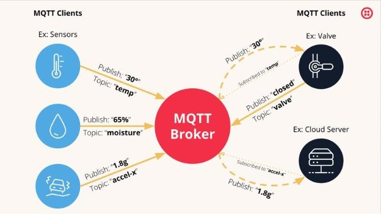

###### [<< Cuprins](/Documentatie/Cuprins.md)
###### [< Aspecte teoretice](/Documentatie/Server/Capitolul%201/2.Aspecte%20teoretice.md)
### Publish/Subscribe

Modelul Publish/Subscribe are 2 componente de baza. 

1. Publisher

Publisherii sunt entitățile care generează și transmit mesaje. Fiecare mesaj este asociat unui anumit "topic", pe care îl vom explica mai târziu. În contextul protocolului MQTT, clienții joacă rolul de publisher atunci când trimit mesaje către broker. 

2. Subscribers

Subscribers sunt entitățile care își manifestă interesul de a primi anumite mesaje, abonându-se la unul sau mai multe topicuri. După abonare, primesc mesajele publicate pe aceste topicuri. În MQTT, clienții devin subscribers atunci când stabilesc o conexiune cu broker-ul, specificând topicul de interes.

###### [4. Broker >](/Documentatie/Server/Capitolul%201/4.Broker.md)