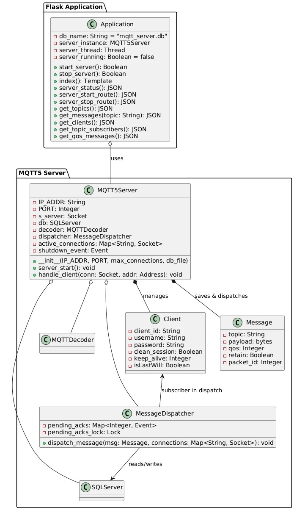
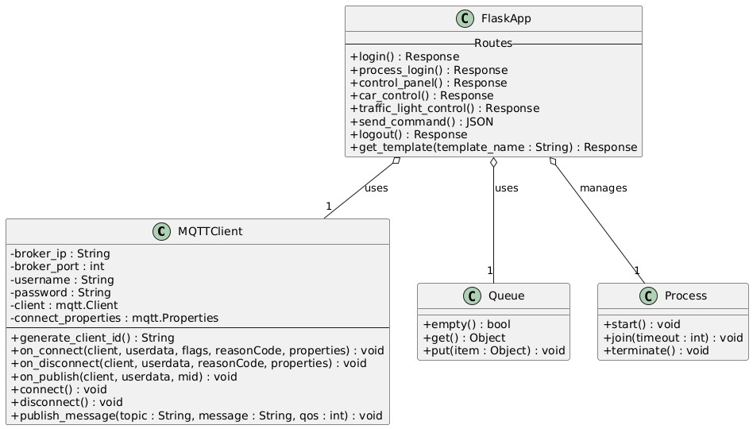
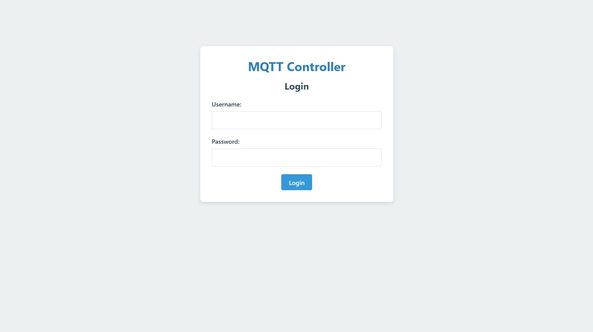
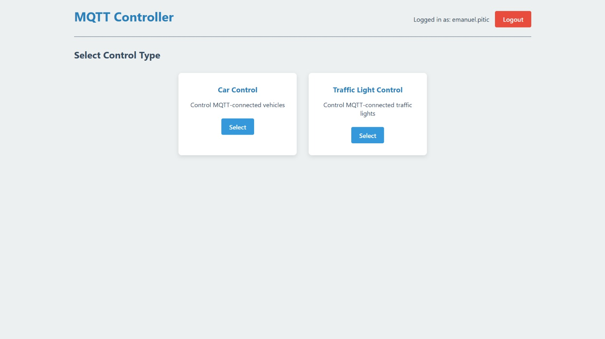
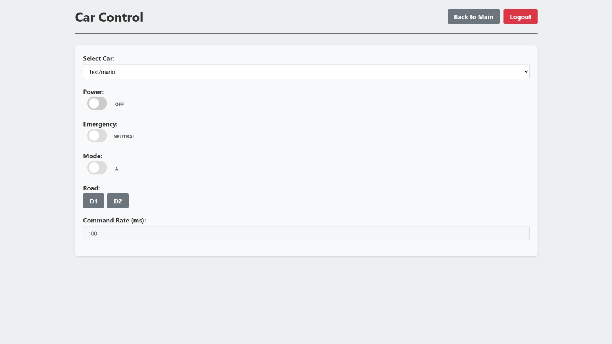
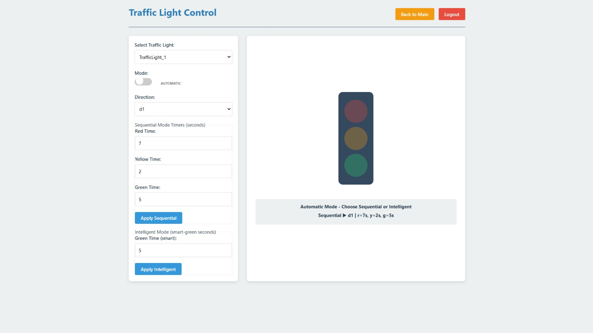
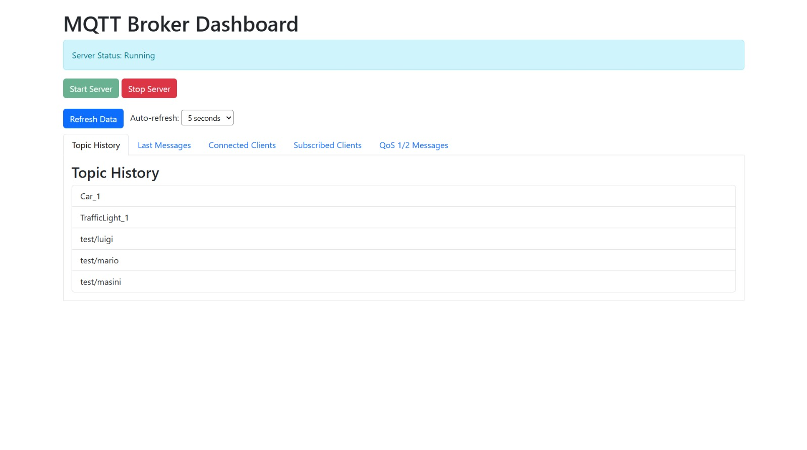
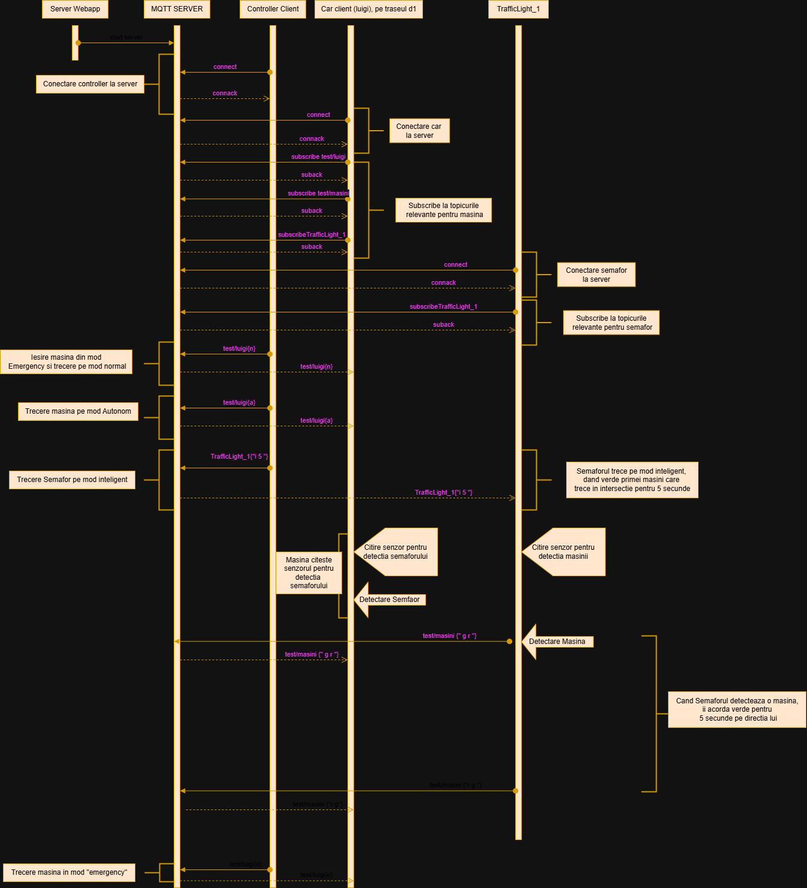

###### [<< Cuprins](/Documentatie/Cuprins.md)
###### [< Subcapitolul 1: 5. Mecanisme MQTT](/Documentatie/Server/Capitolul%201/5.Mecanisme%20MQTT.md)
## Implementare 

Aplicația a fost dezvoltată folosind limbajul de programare Python pe baza principiilor de programare orientată pe obiecte. Au fost utilizate biblioteci standard precum socket, struct și sqlite3 pentru gestionarea conexiunilor, procesarea pachetelor și stocarea datelor. Structura modulară ajută la separarea clară a funcționalităților, astfel încât fiecare parte a codului este mai ușor de gestionat și modificat. 

### Descrierea modulelor 

1. **Server Principal (server.py):** 
- Gestionează conexiunile client folosind socket-uri. 
- Decodează pachetele MQTT cu ajutorul MQTTDecoder. 
- Gestionează mesajele PUBLISH, SUBSCRIBE și alte pachete MQTT conform standardelor MQTT v5. 
- Permite oprirea serverului în siguranță utilizând un eveniment de tip shutdown\_event. 
- Serverul MQTT este pornit din interfața grafică și ascultă pe portul 5050.

2. **Client MQTT (MQTTClient.py):** 
- Simulează un client MQTT care se conectează la brokerul de pe portul 5050.
- Interpretează mesajele primite și acționează în funcție de conținutul acestora (ex: comenzi pentru mașinuța autonomă).
- Este pornit separat și rulează pe portul 5000.

3. **Controller Web Clients (controller.py):**
- Este o aplicație web care permite controlul și monitorizarea abonaților conectați la serverul MQTT, în special a dispozitivelor cheie din rețea, precum mașinuța autonomă și sistemul de control al semafoarelor.
- Comunică atât cu interfața grafică, cât și cu serverul MQTT pentru a gestiona fluxul de mesaje și starea abonaților.

4. **Controller Web Server (mqtt_webapp.py)**
- Interfața web oferă control complet asupra serverului MQTT, permițând pornirea și oprirea acestuia pe portul 5050.
- Rulează pe portul 8082 și comunică atât cu interfața grafică, cât și cu serverul MQTT pentru a gestiona fluxul de mesaje și starea abonaților.
- Această interfață facilitează gestionarea și supravegherea în timp real a întregii rețele MQTT, oferind o vizualizare clară și acces rapid la starea sistemului.
- Prin această interfață se pot monitoriza diverse informații utile despre sistem, precum:
   + Istoricul topicurilor
   + Ultimele mesaje transmise
   + Clienții conectați în prezent 
   + Clienții abonați la diferite topicuri

5. **Decodarea Pachetelor (*decoder.py*):** 
- Decodează tipuri de pachete CONNECT, PUBLISH, SUBSCRIBE, etc. 
- Extrage informații despre topicuri, QoS și payload. 
6. **Dispatcher Mesaje (*message\_dispatcher.py*):** 
- Asigură livrarea mesajelor pe baza abonamentelor. 
- Gestionează QoS pentru pachete cu ACK-uri. 
7. **Baza de Date (*sqlServer.py*):** 
- Stochează clienți, topicuri, abonamente și mesaje. 
- Utilizează SQLite ca platformă pentru stocarea datelor. 
8. **Interfața Grafică (*gui.py*):** 
- Oferă secțiuni precum: istoricul subiectelor , ultimele 10 mesaje, vizualizarea conexiunilor active , abonamentele și mesajele QoS. 
- Posibilitatea pornirii și oprii în siguranță a serverului prin intermediul interfaței grafice. 
9. **Crearea Pachetelor MQTT (*packet\_creator.py*):** 
- Oferă funcții pentru generarea pachetelor, cum ar fi CONNACK, PUBACK, PINGRESP, SUBACK, UNSUBACK, DISCONNECT etc. 
### Structura bazei de date 
- Tabela **clients**: Stochează informații despre clienți (ID, stare conectare, timp de deconectare). 
- Tabela **subscriptions**: Ține evidența abonamentelor clienților la topicuri. 
- Tabela **messages**: Păstrează mesaje publicate, incluzând nivelul QoS și timpul de publicare. 
- Tabela **topics**: Definirea topicurilor și a mesajelor reținute. 
### Diagrama interacțiunilor 

###### [2. Bibliografie >](/Documentatie/Server/Capitolul%202/2.Bibliografie.md)
